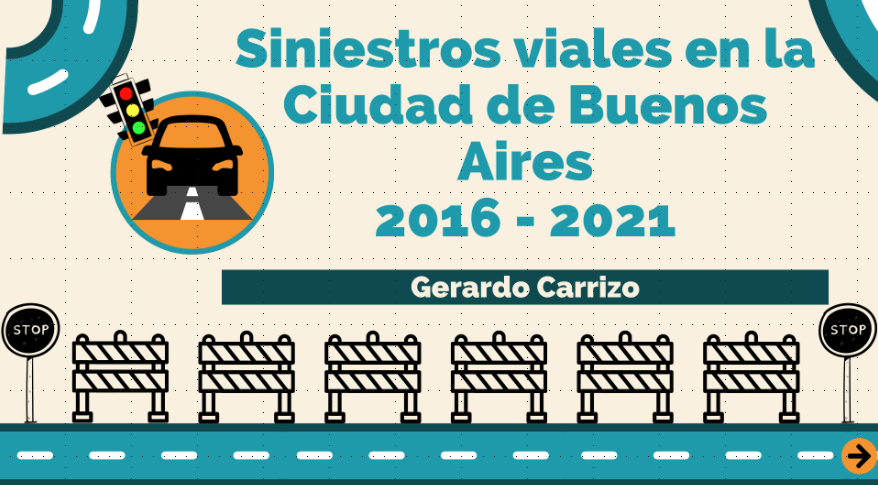
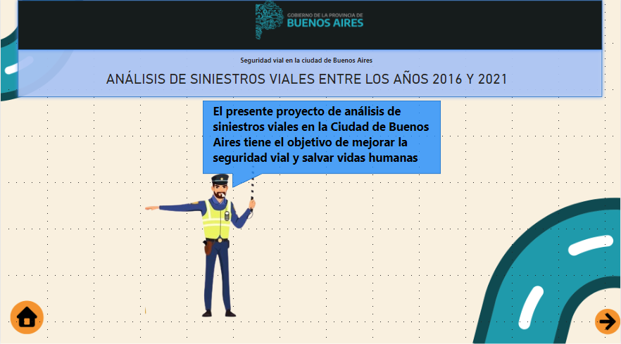
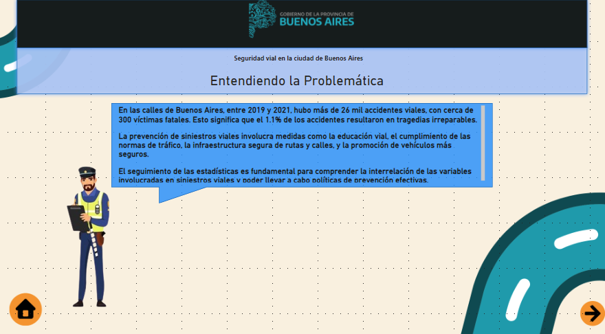
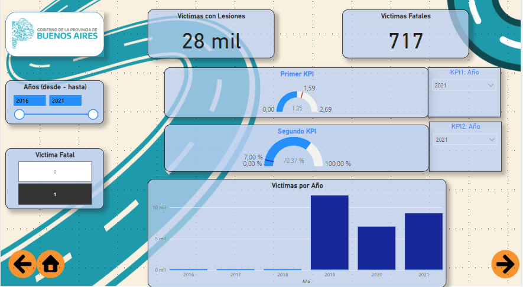
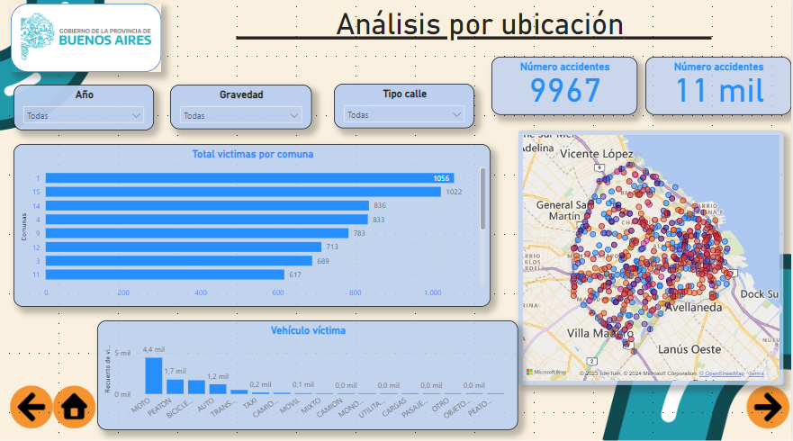
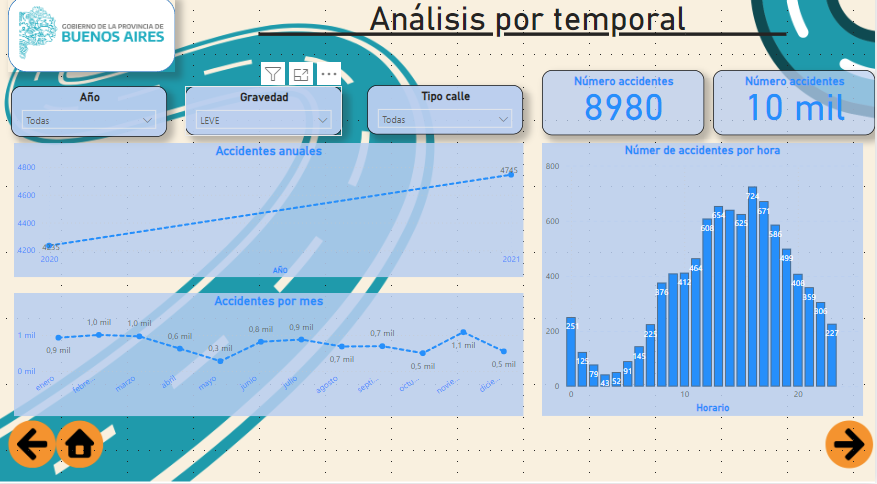
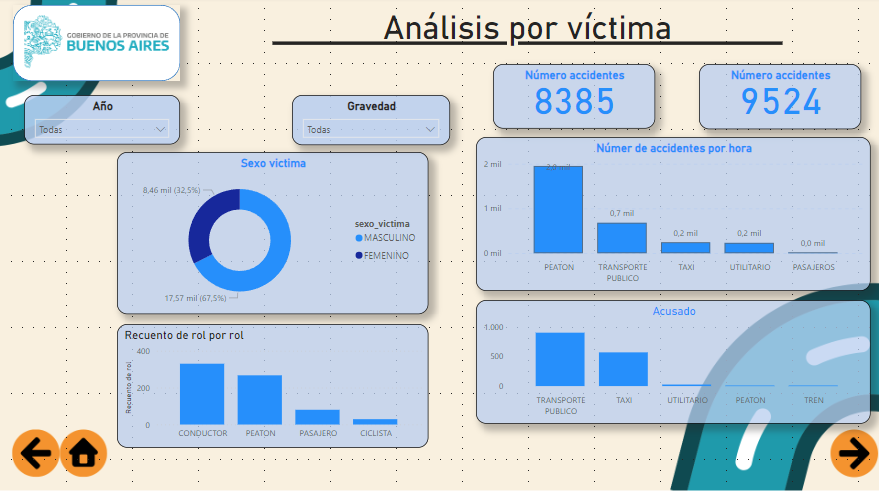
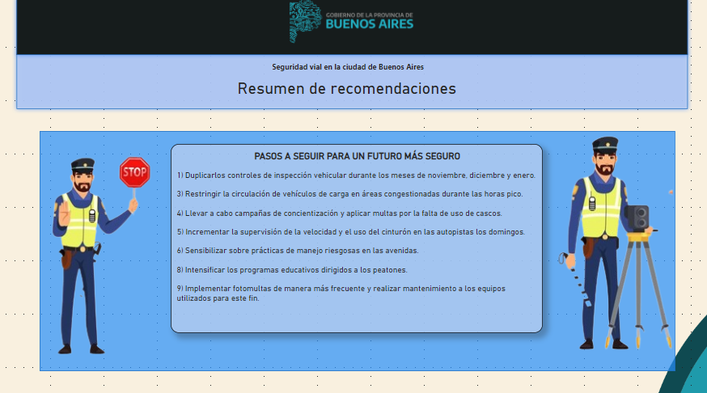

Contactos:

  
  

# Mi Proyecto de Análisis de Datos sobre Siniestros Viales en Buenos Aires

¡Hola! Quiero compartir mi proyecto sobre el análisis de siniestros viales en la Ciudad de Buenos Aires. Utilicé varias herramientas, como Pandas, Numpy, Matplotlib, Seaborn y PowerBI.

## Descripción del Proyecto

El propósito principal de mi proyecto es identificar información relevante que pueda contribuir a la reducción de accidentes fatales en Buenos Aires. Realicé un análisis exhaustivo de los datos proporcionados por el Departamento de Transporte, la Subsecretaría de Planificación de Movilidad y la Oficina de Supervisión de Movilidad y Seguridad Vial desde 2016 hasta 2021.

La información fue extraída de la siguiente página: [Datos Buenos Aires](https://data.buenosaires.gob.ar/dataset/victimas-siniestros-viales).

## Desarrollo del Proyecto

**ETL** : Durante el proceso de Extracción, Transformación y Carga (ETL), gestioné registros de casos y víctimas de siniestros viales. Eliminé columnas irrelevantes, convertí los valores "SD" a nulos, ajusté tipos de datos y estandaricé nombres utilizando la nomenclatura "snake_case". Puedes encontrar detalles en los notebooks [ETL_homicidios](/Notebooks/02_ETL_homicidios.ipynb) y [ETL_lesiones](/Notebooks/02_ETL_lesiones.ipynb).

**EDA** : Durante el Análisis Exploratorio de Datos (EDA), identifiqué patrones interesantes que revelaron información valiosa. Encuentra detalles específicos en el notebook [EDA](Notebooks/04_EDA.ipynb).

**Dashboard**:

En Power BI, creé ocho páginas que incluyen portada, introducción y recomendaciones. Proporcionan información detallada sobre ubicación, momento y características de las víctimas. También incluí una página con Indicadores Clave de Desempeño (KPI) para una visión general completa. Puedes descargar el dashboard [aquí](Dashboard.pbix).

### Páginas del Dashboard

- **Inicio del Dashboard:**

- **Presentación del Dashboard:**

- **Problemática del Dashboard:**

- **KPI del Dashboard:**

- **Análisis de Ubicación:**

- **Análisis Temporal:**

- **Análisis por Víctima:**

- **Recomendacion:**

## Hallazgos

Algunos hallazgos interesantes incluyen:

- La comuna con más fatalidades varió de la 1 a la 4 en 2021.
- Las motocicletas son frecuentes en accidentes fatales en autopistas, mientras que en calles son peatones.
- Las comunas 12 y 11 tienen menos accidentes fatales, y la comuna 6 tiene menos no fatales.
- Comunas 1 y 4 son peligrosas para peatones.
- Descenso significativo de accidentes fatales en 2020, posiblemente debido a la pandemia.

## KPI's

**Objetivo: Reducir en un 10% la tasa de homicidios en siniestros viales en los últimos seis meses en CABA, en comparación con el semestre anterior.**

Se logró una reducción del 23.64% en la tasa de homicidios en siniestros viales durante el último semestre de 2021, superando la meta del 10%.

**Recomendaciones:**
- Campaña de concienciación para motociclistas de 18 a 49 años.
- Instalación de pasos peatonales y semáforos en áreas específicas.
- Reforzamiento de la vigilancia en diciembre.

**Objetivo: Reducir en un 7% la cantidad de accidentes mortales de motociclistas en el último año en CABA, respecto al año anterior.**

Hubo un aumento del 70.37% en accidentes de motociclistas en 2021 en comparación con 2020, alejándose de la meta de reducción del 7%.

**Recomendaciones:**
- Instalación de cámaras de seguridad en autopistas.
- Requisitos más estrictos para obtener el permiso de motocicleta.

Mi objetivo es contribuir a un tránsito más seguro en Buenos Aires, ¡gracias por revisar mi proyecto!

Contactos:

  
  

